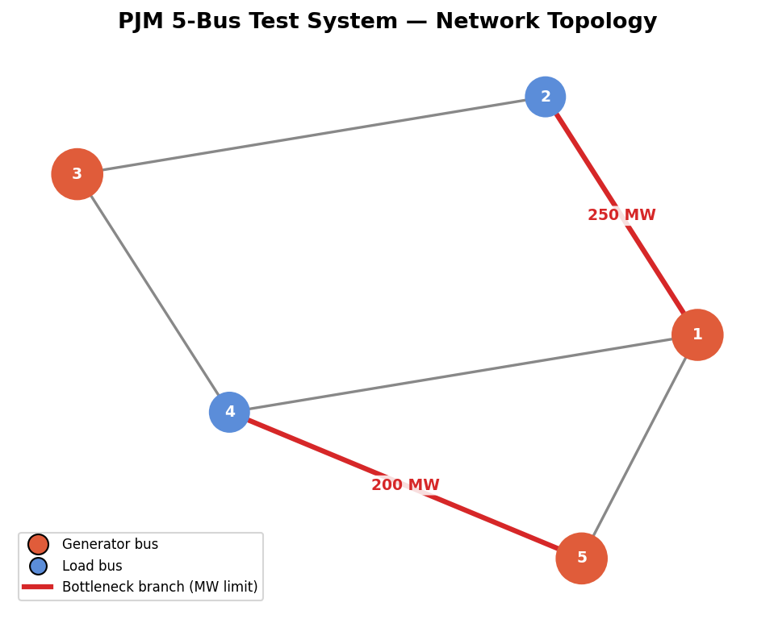
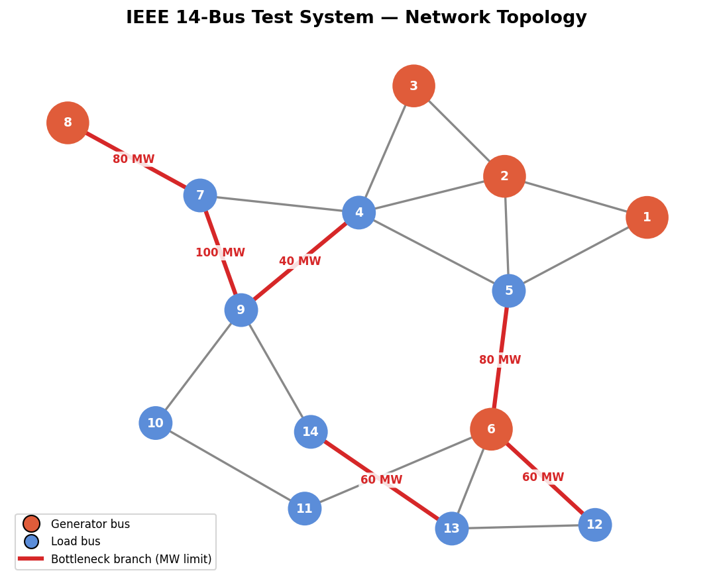
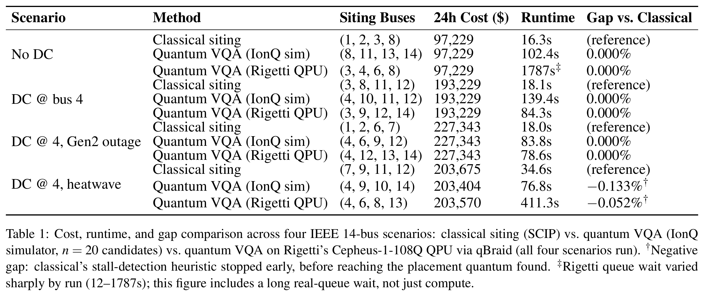

# Quantum Storage Siting

Team: Square Peg Technologies

Project: Quantum Storage Siting — PQIC Challenge

Challenge Track: Storage siting and sizing for resilience and AI load integration

[](https://account.qbraid.com?gitHubUrl=https://github.com/Square-Peg-Technologies/square-peg-quantum-challenge.git&redirectUrl=/README.md)

Hybrid quantum-classical solver for battery energy storage system (BESS) siting
on power system test grids. Everything needed to install, run, and reproduce
results is in this one document — setup and usage come first, background and
results detail follow.


## Setup

Requires Python 3.12 (any patch version — developed and tested against 3.12.2,
but nothing here depends on that exact patch release).

### Step 1: get a Python 3.12 interpreter

Skip this step entirely if `python3.12 --version` already works.

**Option A — already on Ubuntu/Debian/Mint and don't have 3.12:** prebuilt
package via the deadsnakes PPA, no compiling, done in under a minute:

    sudo apt update && sudo apt install -y software-properties-common
    sudo add-apt-repository ppa:deadsnakes/ppa
    sudo apt update
    sudo apt install python3.12 python3.12-venv

**Option B — deadsnakes isn't available (non-Ubuntu-based distro, or you
specifically need pyenv's per-project version management):** pyenv builds
Python from source, which means it needs these system libraries installed
*first* — this is a one-time step per machine, not something to repeat on
every rebuild:

    sudo apt install -y build-essential libssl-dev zlib1g-dev libbz2-dev \
      libreadline-dev libsqlite3-dev libncursesw5-dev tk-dev libxml2-dev \
      libxmlsec1-dev libffi-dev liblzma-dev

Then install pyenv and build 3.12.2 with it:

    [ -d ~/.pyenv ] || curl https://pyenv.run | bash   # safe to re-run: skips reinstalling pyenv if it's already there
    exec $SHELL   # reload your shell so the pyenv command is available
    pyenv install 3.12.2   # if this says the version already exists but Step 2 can't find it, the build is broken: rm -rf ~/.pyenv/versions/3.12.2 and re-run this line
    ~/.pyenv/versions/3.12.2/bin/python3.12 -c "import ctypes, bz2, sqlite3, lzma, curses, readline"   # must print nothing/exit 0 — if this errors, a library from the apt install above wasn't picked up: rm -rf ~/.pyenv/versions/3.12.2, confirm the apt install ran, and re-run pyenv install

If this sanity check keeps failing after confirming the `apt install` ran,
the fix is always the same: delete the broken build and rebuild it —
`rm -rf ~/.pyenv/versions/3.12.2` then `pyenv install 3.12.2` again. The
system libraries from the `apt install` step don't need reinstalling; only
the Python build itself needs redoing.

### Step 2: create the venv and install dependencies

Run these from inside this repo's root folder (the one containing this
README) — creating the venv from a parent or sibling directory will
silently pick up whatever Python that directory falls back to instead of
this one.

If Python 3.12 is on your `PATH` (Option A above, or any other way you got
it):

    python3.12 -m venv .venv
    source .venv/bin/activate   # activate the venv — repeat this in every new terminal session
    .venv/bin/python --version   # must print Python 3.12.x — stop and fix if not
    .venv/bin/pip install -r requirements.txt

If you built it with pyenv (Option B above):

    pyenv local 3.12.2
    ~/.pyenv/versions/3.12.2/bin/python -m venv .venv
    source .venv/bin/activate   # activate the venv — repeat this in every new terminal session
    .venv/bin/python --version   # must print Python 3.12.x — stop and fix if not
    .venv/bin/pip install -r requirements.txt

Always activate the venv or use `.venv/bin/python` explicitly — never system python.

If `pip install` tries to compile `symengine` from source (long CMake build
output instead of downloading a `.whl`), the venv is on the wrong Python
version — recheck `.venv/bin/python --version` and recreate the venv if it's
not 3.12.x.

All dependencies are contained in this repo — `pip install -r requirements.txt`
is the whole story. `qiskit-aer` was intentionally dropped to keep the
dependency set minimal — it only accelerated/enabled the Aer Tensor Network
(MPS) VQA backend for 36+ qubit runs (ieee30), which is currently hidden
from the UI anyway (see the judge-facing build note below); the "Qiskit"
backend still works fully via qiskit's own `StatevectorSampler`. Add
`qiskit-aer==0.15.1` back to `requirements.txt` to restore Aer TN.

### qBraid API Key (optional)

Only needed for Quantum Siting's **Sampling** options that route the final
shot sample through a real qBraid-hosted device — **IonQ (qBraid29sim)**,
**IonQ (qBraid29sim, noise)**, and **Rigetti (qBraid QPU)**. The default,
**Local (Qiskit)**, needs no credentials at all — everything stays on your
machine.

To use any of the qBraid-routed options:

1. Get an API key from [account.qbraid.com](https://account.qbraid.com) (starts with `qbr_`).
2. Create a file named `.env` in the repo root (never commit this file):

       IONQ_TOKEN=your_qbraid_api_key

   (The variable is named `IONQ_TOKEN` for historical reasons, but it's your
   general qBraid platform key — the same one authenticates both the IonQ
   and Rigetti routes; see `solvers/ionq_qbraid_backend.py` and
   `solvers/rigetti_qbraid_backend.py`.)
3. `python-dotenv` (already in `requirements.txt`) loads it automatically —
   no need to `export` it yourself, though an actual environment variable
   still works too and takes precedence if both are set.

IonQ's qBraid-hosted simulator is free (only real IonQ QPU hardware bills
credits); Rigetti has no free-simulator route, so every Rigetti sampling run
bills qBraid credits and queues for real QPU time.

Standalone test scripts for checking this setup directly, outside the
dashboard/CLI: `scripts/IonQ_test.py`, `scripts/Rigetti_test.py`.


### Dashboard (Browser UI)

    .venv/bin/python dashboard.py

then open http://127.0.0.1:7860. Stop the server with Ctrl-C. Note the server
does not hot-reload: after pulling code changes, restart it.

One tab per problem, each with a compact control bar of inputs on top and
results below in sub-tabs:

    Dispatch               Problem type (Economic Dispatch / Unit Commitment),
                           use case, assets, hours T (defaults to 24)
    Battery Siting (MIP)   + time limit (s, fixed to 600, non-interactive),
                           loss re-solve top-K (fixed to 20, non-interactive)
    Quantum Siting         + sampling, candidates (fixed to 20, non-interactive),
                           time limit (s, fixed to 60, non-interactive),
                           2nd stage, warm start

Economic Dispatch and Unit Commitment share a single "Dispatch" tab, switched
via a "Problem type" radio next to the control bar — same inputs, same
Plots/Terminal sub-tabs either way; only the backend solver called on Run
differs (`solvers/ed.py` vs `solvers/uc.py`, both unchanged). A note under the
controls flags that battery placement on this tab is fixed to each use case's
`locations.py` (not optimized) — use Battery Siting (MIP) or Quantum Siting
for placement search.

The Power Flow tab (per-candidate network diagrams from the latest Quantum
Siting run) is currently hidden from the UI — the backend/gallery code is
unchanged and still populated by every Quantum Siting run, it's just not
shown as a tab (`visible=False` on that `gr.Tab` in `dashboard.py`; flip it
back to bring it back).

Sub-tabs per problem: Results (quantum only — candidate ranking table),
Plots (all of the run's plots side by side, scaled to fit the window),
Runtime (quantum only — phase breakdown chart), and Terminal — the exact
CLI output including full tracebacks, with a copy button for easy debugging.

Backend (how the VQA trains) is currently fixed to Qiskit local CPU
statevector and not exposed as a control — Aer Tensor Network (MPS) exists
in the solver for 36+ qubit cases (ieee30, itself currently hidden — see
note above) and is otherwise slower on the visible cases. **Sampling** picks
where the final shot sample comes from: **Local (Qiskit)**, using the same
simulator that trained the circuit (no credentials needed); **IonQ
(qBraid29sim)**/**IonQ (qBraid29sim, noise)**, a real qBraid-routed IonQ
simulator submission for just that final shot sample (free — only real QPU
hardware bills credits; the noise variant applies the Forte-1 hardware noise
model, also free); or **Rigetti (qBraid QPU)**, a real submission to
Rigetti's Cepheus-1-108Q QPU via qBraid QCS for the final shot sample (bills
qBraid credits/QCS time — no free-simulator route for Rigetti). The two
qBraid-routed options need a
qBraid API key — see "qBraid API Key" under Setup above. Any mid-run failure
pops a warning toast and the traceback lands in the Terminal sub-tab.

**Rigetti queue timeout caveat:** `run_circuit_shots` in
`solvers/rigetti_qbraid_backend.py` waits on `job.wait_for_final_state(timeout=600, ...)`
— a 10-minute cap. If the real QCS queue is backed up longer than that (seen
in practice — e.g. during a scheduled maintenance window), the run raises a
client-side `TimeoutError` even though the job keeps running and often
completes successfully on Rigetti's side minutes later. The job isn't lost —
its ID is in the traceback (`Timeout while waiting for job <id>`), and you
can look up its status/result directly on qBraid. To recover a result that
completed after a local timeout, save the job's result JSON (must include
`resultData.measurementCounts`) and run:
```
python scripts/reprocess_rigetti_result.py <assets_file> <result_json_path>
```
This replays only the local, free, classical post-processing (bitstring
ranking + UC/ED evaluation) against the real measurement counts — it does
not resubmit a job or spend additional credits. See the script's docstring
for details.

Result caching — every run is recorded with its exact input settings.
Clicking Run with settings that were already run loads the stored results
instantly ("✅ Already run — loaded from <timestamp>") instead of re-solving.
Tick "Re-run even if cached" to force a fresh solve. Plots are snapshotted
per-run, so cached runs keep showing the correct images even after later runs
overwrite the shared filenames in `outputs/`.

Run history — a strip at the bottom of every problem tab lists all past runs
(any problem, newest first) and survives restarts.

Power Flow (hidden, see above) — when re-enabled, shows one network diagram
per evaluated candidate placement from the latest Quantum Siting run, ranked
by true cost — committed/off generators, battery buses, and per-line max
loading (orange ≥70%, red ≥90%).

Comparing classical vs quantum — Battery Siting (MIP) and Quantum Siting
solve the same problem; the quantum tab generates the same grid +
dispatch-overview plots for its best placement (saved as `quantum_*.png` vs
`siting_*.png` so neither overwrites the other).

Files written by the dashboard:

    outputs/dashboard_settings.json   last-used inputs per tab (restored on launch)
    outputs/dashboard_history.json    run history index (cache keys, summaries)
    outputs/dashboard_runs/           per-run terminal logs + plot snapshots
    outputs/powerflow/                latest quantum run's candidate diagrams

### CLI

    .venv/bin/python main.py

Prompt flow — Step 1, choose the optimization:

    1. Economic Dispatch (ED)
    2. Unit Commitment (UC)
    3. Battery Siting (exhaustive search)
    4. Quantum Siting (Hybrid VQA + Classical)

For option 4 only, additional sub-prompts. The VQA backend prompt is
currently skipped (judge-facing build) — it's hardcoded to Qiskit
(statevector simulator); see the note near the top of this section for how
to restore it:

    Sample final shots on:
      1. Local (Qiskit) (same simulator used for training)
      2. IonQ via qBraid (real hardware/simulator — free simulator, QPU spends credits)
      3. IonQ via qBraid (Forte-1 noise model — free simulator)
      4. Rigetti via qBraid (real QPU — bills qBraid credits/QCS time, no free simulator)

    Options 2-4 need a qBraid API key — see "qBraid API Key" under Setup above.

    How many candidates to evaluate classically? [default: 10]:

    Second-stage solver:
      1. ED dispatch (fix commitment and placement)
      2. Full UC re-solve (fix placement only)

    Warm-start strategy (arXiv:2505.00145):
      1. zeros  — theta=0, paper simulation default [default]
      2. random — theta~Uniform[-2pi,2pi], paper IonQ hardware default
      3. sdp    — LP-relaxation warm start, paper Section III

Step 2 — use case. Currently only `ieee14` is offered (ieee30, pjm5, and
ieee14_plexos_basecase are hidden from this prompt — see the note near the
top of this section). Step 3 — assets file (scanned from the use case
directory, e.g. `4batt_dcbus4.py`; three dcbus variants are likewise
hidden). Step 4 — hours, bounded by the loaded case's actual demand profile
(all use cases build a one-week, 168-hour profile, so the prompt's max
scales to whatever the case supports):

    How many hours to simulate? (1-168):

Example output (Quantum Siting, ieee14, T=24h, `4batt_dcbus4.py`):

    Running Quantum Siting optimization for T=24 hours...
    Aer: using CPU statevector

    Quantum Siting Results (Qiskit VQA + UC refinement)
    Warm-start:                 θ=0 (paper sim default)
    Qubits / params:            19 / 114
    Shots — COBYLA / final:     512 / 5000
    Quantum candidates found:   10
    Candidates evaluated:       10  (of 1001 total placements)
    Runtime — quantum sieve:    145.6s
    Runtime — classical stage:  10.1s

    Best placement: buses (2, 4, 6, 7), cost $199,804

    Rank   Bat Placement           True Cost ($)
    --------------------------------------------
    1      (2, 4, 6, 7)                 199,804
    ...

### Quality Gate

    .venv/bin/ruff check main.py solvers/ tests/ plots.py
    .venv/bin/mypy main.py solvers/ --ignore-missing-imports
    .venv/bin/pytest tests/ -m "not slow" -v
    .venv/bin/pytest tests/ -m slow -v        # Qiskit VQA path (~30s)


## Repo Layout

    main.py                 Entry point. Interactive CLI, dispatches to solvers.
    dashboard.py             Gradio browser dashboard.
    plots.py                 Network visualization + runtime breakdown charts (PNG per run).
    requirements.txt         Python dependencies, CPU-only (includes gradio for the dashboard).

    dcopf/                   Vendored grid-topology base classes (BaseCase, BaseCaseDescription)
                              — PTDF/Btilde construction from MATPOWER-style case data.
                              Self-contained, numpy-only, no external project dependency.

    use_cases/
        pjm5/                 PJM 5-bus grid: 5 buses, 6 branches, 3 generators, 2 batteries.
        ieee14/                IEEE 14-bus grid: 14 buses, 20 branches, 5 generators, 4 batteries,
                              optional 200 MW AI datacenter load (4batt_dcbus{N}.py).
        ieee30/                IEEE 30-bus grid: 30 buses, 6 generators (335 MW total).

    solvers/
        results.py            EDResult, UCResult, SitingResult, QuantumSitingResult.
        ed.py                  Economic Dispatch (QP, HiGHS).
        uc.py                  Unit Commitment (MIQP, SCIP). Generic — works for any grid size.
        siting.py              Exhaustive battery siting loop.
        quantum_siting.py      VQA/SA sieve + classical refinement + debug logger.

    tests/                   Unit + integration tests (see Quality Gate above).

    assets/                  Rendered network topology diagrams embedded in this README.
    scripts/                 One-off dev/debug scripts, including the generators for the
                              assets/ topology diagrams (generate_ieee14_topology_diagram.py,
                              generate_pjm5_topology_diagram.py) and Check_Job.py (polls
                              status/result/usage metrics for a submitted IBM Quantum
                              Runtime job by ID).

    Formulation/
        Siting_Formulation.pdf/.tex   Problem formulation document + LaTeX source.
        IonQ_ORNL_Unit_Commitment_2505.00145.pdf   Reference paper (Aboumrad et al., 2025).
        QUANTUM_FLOW.md         Quantum algorithm flow description.
        Test_Quantum_examples/  IonQ paper benchmark scripts.

    outputs/                 Generated plots and debug logs (gitignored).
    Constitution/             Internal planning docs (gitignored).


## What It Does

Four levels of power system optimization, all including battery storage dynamics:

1. Economic Dispatch (ED): All generators stay on. Finds least-cost dispatch
   each hour subject to line flow limits and battery SoC dynamics. Solved as
   a convex QP using HiGHS.

2. Unit Commitment (UC): Adds binary on/off decisions per generator per hour.
   Solved as a MIQP using SCIP.

3. Battery Siting: Exhaustive search over all C(N, B) battery placements.
   Runs a full UC solve per placement and ranks by total system cost.

4. Quantum Siting: Hybrid quantum-classical algorithm. A quantum sieve searches
   the joint (generator commitment, battery placement) space using a cheap proxy
   cost function, producing a ranked shortlist. Each candidate is then evaluated
   with a full classical UC or ED solve.

   Two independent choices control the quantum sieve:
   - VQA backend (how training runs) — Qiskit: Butterfly ansatz
     (arXiv:2505.00145), COBYLA optimizer, local CPU statevector simulator.
     Aer Tensor Network (MPS): Linear-chain HEA ansatz, matrix product state
     simulator, scales to 36+ qubits (ieee30).
   - Sampling backend (where the final shot sample comes from) — Local: same
     simulator used for training. IonQ via qBraid: submits the converged
     circuit for a real final shot sample on qBraid-routed IonQ
     hardware/simulator (training still runs locally either way — Qiskit VQA
     is compatible with IonQ Forte gate hardware). Rigetti via qBraid:
     submits the converged circuit to Rigetti's Cepheus-1-108Q QPU for the
     final shot sample — requires client-side transpilation to Rigetti's native
     gate set and a real qubit-connectivity coupling map before submission,
     since qBraid's own compilation pipeline doesn't do this automatically
     for non-IonQ providers (see solvers/rigetti_qbraid_backend.py).

All modes use a DC power flow approximation (lossless branches, no reactive power).

Based on the IonQ/ORNL hybrid quantum-classical algorithm (arXiv:2505.00145,
`Formulation/IonQ_ORNL_Unit_Commitment_2505.00145.pdf`).


## Use Cases

### PJM 5-Bus (pjm5)

Standard academic test network from MATPOWER case5 (Li & Bo, 2010 IEEE PES).

Network topology — generator buses in orange, load buses in blue, and the
two constrained branches in red with their MW limits (regenerate with
`scripts/generate_pjm5_topology_diagram.py` if line limits change):



Lines 1-2 (250 MW) and 4-5 (200 MW) are the only constrained lines — these
are the limits in `self.fbar`, the values actually enforced by the DC-OPF
solver (the branch table's `rateA` column has unused placeholder values of
400/240 MW for these two lines).

Generators (from arXiv:2505.00145 Table I):

    Unit    Bus    p_min    p_max    a ($/MW²h)    b ($/MWh)    c ($)
    ----    ---    -----    -----    ----------    ---------    -----
    0        1     100 MW   600 MW    0.002          10          500
    1        3     100 MW   400 MW    0.0025           8          300
    2        5      50 MW   200 MW    0.005            6          100

Batteries: 2 × 50 MW / 200 MWh, 85% efficiency, initial SoC 50%.

Demand: 24-hour shape calibrated to arXiv:2505.00145 Table IV (170-1100 MW total),
repeated over 7 days for a one-week (168h) horizon.
Unit 2 always runs; Unit 0 is the swing unit; Unit 1 ramps mid-day.

Quantum siting: 3 gen + 5 bus = 8 qubits, C(5,2) = 10 placements.


### IEEE 14-Bus (ieee14)

IEEE 14-bus test system (American Electric Power, 1962, MATPOWER case14).
Includes a synthetic 200 MW AI datacenter load added at a chosen bus.

Network topology — generator buses in orange, load buses in blue, and the
six tightened bottleneck branches in red with their MW limits (regenerate
with `scripts/generate_ieee14_topology_diagram.py` if line limits change):



Generator buses: 1, 2, 3, 6, 8
Load buses:      2, 3, 4, 5, 6, 9, 10, 11, 12, 13, 14
Transformer branches: 4-7 (ratio 0.978), 4-9 (ratio 0.969), 5-6 (ratio 0.932)

Base load: 259 MW across 11 buses. Demand shaped 0.45x (night) to 1.40x (peak),
repeated daily over a one-week (168h) horizon — battery SoC free-floats
continuously across the week, no reset between days.
With 200 MW datacenter: peak total demand ~563 MW.

Key transmission bottlenecks (line limits tightened from original unlimited case14):

    Branch    Limit     Notes
    ------    -----     -----
    4-9        40 MW    Tightest bottleneck — transformer to bus-9 cluster
    5-6        80 MW    Sole path from main network to bus-6 cluster
    6-12       60 MW    Limits supply to bus 12
    13-14      60 MW    Restricts power to bus 14
    7-8        80 MW    Transformer to Gen 5 at bus 8
    7-9       100 MW    Path to lower bus cluster

Full line limits in branch order [MW]:

    [400, 120, 120, 120, 120, 120, 9999, 80, 40, 80, 80, 60, 120, 80, 100, 200, 80, 80, 80, 60]

Generators (MATPOWER case14 / gencost, linear cost function):

    Gen    Bus    p_min     p_max     $/MWh    Notes
    ---    ---    -----     -----     -----    -----
    1       1      50 MW    332 MW      20     Swing bus, cheapest
    2       2      20 MW    140 MW      20     Second cheapest
    3       3      20 MW    100 MW      40     Higher cost
    4       6      20 MW    100 MW      40     Higher cost
    5       8      20 MW    100 MW      40     Higher cost

Total capacity: 772 MW. Peak demand 563 MW requires Gen 1 + Gen 2 + at least
one of Gen 3/4/5.

Batteries: 4 × 50 MW / 200 MWh, 90% efficiency, initial SoC 100%.
Quantum siting: 5 gen + 14 bus = 19 qubits, C(14,4) = 1,001 placements.

Datacenter bus selection: buses 6-14 are infeasible (line limits violated).
Run `site_datacenter.py` to regenerate feasibility/cost rankings after any
change to line limits or datacenter size:

    cd use_cases/ieee14 && python site_datacenter.py

NOTE: the last regenerated ranking (T=24h) gives buses 1, 2, 3, and 4 an
identical \$228,429 cost and bus 5 at \$228,755 — this has drifted from an
older documented ranking that showed bus 4 and bus 5 as distinctly more
expensive with bus 3 infeasible. That older ranking predates the one-week
demand-horizon extension; it has not been root-caused yet and needs
re-verifying against the current case data before being treated as
authoritative. Re-run the script above and use its live output, not this note.

IMPORTANT — for meaningful congestion and a non-trivial P_loc(s) battery signal,
use `4batt_dcbus4.py` or `4batt_dcbus5.py`. With the datacenter at bus 1 or
bus 2 the network is uncongested: all buses price identically and the P_loc
term contributes zero to the proxy cost. Bus 4 and bus 5 force the optimizer
to route power through tight transformers and mid-network lines, creating
spatial LMP differentiation and a meaningful congestion relief signal for
battery siting.

Confirmed quantum siting result (Qiskit VQA + UC, T=24h, n=10):
Best placement buses (2, 4, 6, 7), cost \$199,804 in ~2.5 min.

### LMP and Shadow Price Extraction

`use_cases/ieee14/extract_lmps.py` runs a no-battery DC-OPF on ieee14 and
extracts LMPs and shadow prices for analysis:

    .venv/bin/python use_cases/ieee14/extract_lmps.py

Outputs to `outputs/` (created automatically):

    lmps_14x24.csv           LMP at each bus for each of the 24 hours (14 × 24)
    shadow_prices_20x24.csv  Shadow price on each line for each hour (20 × 24)
    lmp_summary.csv          Per-bus LMP mean, variance, std, min, max

LMPs are the nodal marginal prices (\$/MWh). Shadow prices on binding lines are
the congestion components — a bus with high PTDF exposure to a binding line has
high congestion relief value for battery placement.

The quantum solver computes these internally at runtime (see P_loc below).
`extract_lmps.py` is a standalone diagnostic tool for inspection and for
sharing data with external tools (e.g. PLEXOS baseline comparison).

Note: with the datacenter at bus 1 or bus 2 no lines bind and all shadow prices
are zero — `extract_lmps.py` will show uniform LMPs and an empty binding-lines
list. Use `4batt_dcbus4.py` or `4batt_dcbus5.py` for non-trivial output.


## Quantum Siting — How It Works

Proxy cost function (evaluated analytically per sampled bitstring, no solver call):

$$
Q(u, s) = c_{\min}(u) + \lambda_1 P_{\text{budget}}(s) + \lambda_2 P_{\text{infeas}}(u) - P_{\text{loc}}(s)
$$

$c_{\min}(u)$ — lower-bound dispatch cost:

$$
c_{\min}(u) = T \sum_g u_g \left(a\, p_{\min,g}^2 + b\, p_{\min,g} + c\right)
$$

$P_{\text{budget}}(s)$ — penalises placing $\ne B$ batteries:

$$
P_{\text{budget}}(s) = \left(\sum_i s_i - B\right)^2
$$

$P_{\text{infeas}}(u)$ — generator shortfall penalty:

$$
P_{\text{infeas}}(u) = \max\left(0,\ D_{\text{peak}} - \sum_g u_g\, P_{\max,g}\right)^2
$$

$P_{\text{loc}}(s)$ — congestion relief reward (defined below):

$$
P_{\text{loc}}(s) = T \sum_i s_i \cdot \text{signal}_i
$$

Batteries are excluded from $P_{\text{infeas}}$: batteries shift energy across hours
but cannot create new peak capacity. Generator commitment alone must cover
peak demand.

$$
\lambda_1 = 2\, c_{\min,\text{total}} \qquad\qquad
\lambda_2 = \frac{20\, c_{\min,\text{total}}}{D_{\text{peak}}^2}
$$

$\lambda_1$: one-battery deviation costs more than max savings.
$\lambda_2$: any generator shortfall dominates $c_{\min}$ savings.

**$P_{\text{loc}}(s)$ — congestion relief battery location term**

Before the quantum sieve, the solver runs a no-battery DC-OPF (CVXPY/HiGHS)
on the loaded grid to extract line shadow prices $\mu_{l,t}$ (20 × 24 for ieee14).

For each bus $i$:

$$
\text{signal}_i = P_{\text{bat}} \sum_l \left(-\text{PTDF}_{l,i} \cdot \mu_{\text{mean},l}\right)
$$

where $\mu_{\text{mean},l}$ is the time-averaged shadow price on line $l$ (\$/MWh), and
$P_{\text{bat}}$ is the battery power rating (MW). Units of $\text{signal}_i$ are \$/h.

Positive $\text{signal}_i$ means a battery injection at bus $i$ tends to reduce flow
on binding lines (congestion relief). Negative means it worsens congestion.

Subtracting $P_{\text{loc}}$ from $Q$ steers the quantum sieve toward buses with high
congestion relief value without changing the feasibility structure. The term
is in the same dollar units as $c_{\min}$ so no additional $\lambda_3$ scaling is required.

The $P_{\text{loc}}$ term is zero when no lines bind (e.g. datacenter at bus 1 or 2).
With the datacenter at bus 4, lines 1-5 and 2-4 bind at peak; buses 4-14
receive signal values of ~160-302 \$/h, with bus 4 highest at ~302 \$/h.
With the datacenter at bus 5, line 1-5 binds; buses 3-14 receive signal.

If the no-battery OPF solve fails for any reason, signal defaults to zero
and the proxy degrades gracefully to the original three-term form.

Qubit encoding:

$$
[\,u_0, \ldots, u_{G-1},\ s_0, \ldots, s_{N-1}\,]
$$

All counts ($G$, $N$, $B$) are resolved from the loaded assets at runtime — nothing
is hardcoded. Alternative asset files with different generator/battery counts
work automatically.

Qiskit VQA path:
    Butterfly ansatz (arXiv:2505.00145), L=3 layers for simulation
    (L=6 targeted for IonQ Forte Phase 3)
    Parameters: 2 × L × (G + N)  →  114 for ieee14
    COBYLA optimizer, 512 shots/iteration, adaptive evaluation cap
    maxfun = max(150, 6 × n_params) → 684 for ieee14 (114 params);
    plateau detection (114 consecutive stale evals) typically stops a
    converged run earlier — e.g. nfev=116 in a validated post-fix test
    Final sampling shots — Local: 5,000. IonQ (qBraid29sim): 100 (IonQ's
    minimum accepted shot count; the optimality gap vs. the real optimum
    already flattens hard by this point — solvers/stop_conditions.md).
    Rigetti (qBraid QPU): 200. Top-N candidates passed to classical stage
    either way.
    Total: up to ~350,000 proxy evaluations (all analytical, worst case
    maxfun × 512) + N UC/ED solves; a converged run needing far fewer
    Simulator: Qiskit StatevectorSampler (CPU) — or qiskit-aer's, if
    reinstalled (see qiskit-aer note under Setup)
    Circuit depth/gates (ieee14, 19 qubits, 3 layers): 70 depth, 192
    entangling (rzx) gates as sent to IonQ (no client-side transpile — IonQ
    hardware is all-to-all connected). Rigetti requires client-side
    transpile + real coupling-map routing (Cepheus-1-108Q, square lattice —
    solvers/rigetti_qbraid_backend.py): ~1460 depth, ~1000 two-qubit (cz)
    gates post-routing — expect correspondingly higher hardware noise than
    the IonQ path.

Aer Tensor Network (MPS) path:
    Linear-chain HEA ansatz, L=4 layers
    Parameters: 2 × L × (G + N)  →  214 for ieee30 (36 qubits)
    Same COBYLA optimizer and shot counts as Qiskit VQA path
    Simulator: qiskit-aer matrix_product_state — memory scales with
    entanglement, not 2^n, enabling 36-qubit runs on CPU
    Warm-start strategies identical to Qiskit VQA path

Classical second stage:
    ED mode: commitment fixed from sieve bitstring. OFF generators have
             p_min/p_max zeroed before the ED solve.
    UC mode: commitment ignored — UC re-optimises freely per hour.
             Candidates sharing the same battery placement are deduplicated
             (one UC solve per unique placement).

Debug log: every run writes `outputs/quantum_siting_debug.log` with all
candidate pass/fail outcomes and error messages for post-run diagnosis.


## CPU-only

Everything in this repo — ED, UC, Siting MIP, and both VQA backends (Qiskit,
Aer Tensor Network) — trains on CPU, including when the sampling backend is
set to IonQ or Rigetti via qBraid (only the final shot sample leaves the
machine either way).
No GPU or CUDA install is required. The Aer Tensor Network (MPS) backend's
memory scales with entanglement rather than qubit count, which is what lets
it reach 36+ qubits (ieee30) without needing a GPU-accelerated statevector.

Always source the venv before running to ensure the venv's Qiskit build is
used rather than any system-level installation.


## Solver Performance

    Optimization       Backend          pjm5 (T=24)     ieee14 (T=24)    ieee30 (T=24)
    ------------       -------          -----------     -------------    -------------
    Economic Dispatch  HiGHS (QP)       < 1s            < 1s             < 1s
    Unit Commitment    SCIP (MIQP)      < 5s            < 5s             < 5s
    Battery Siting     Benders/SCIP     < 1 min         ~15s             ~30s
    Quantum Siting     Qiskit VQA+UC    ~10s            ~2.5 min         —
    Quantum Siting     Aer TN (MPS)+UC  —               ~1.5 min         ~40-70s

Quantum Siting quantum phase is independent of T; classical stage scales ~linearly
with T and n_candidates. Figures above are measured at T=24 (one day); all
three cases now support T up to 168 (one week) — expect the classical
stage/ED/UC timings to scale roughly 7x at T=168, since the quantum sieve
itself does not depend on T.


## Limitations

- DC power flow approximation only: no reactive power, no voltage
  magnitude/angle constraints. Resistance-based line losses are available as
  an opt-in `line_losses=True` mode (classical Benders siting solver and the
  quantum candidate-evaluation path), but the default is still lossless —
  Plexos comparisons use resistance-based losses, this model's default does
  not.
- Neither the classical nor the quantum path has a *proven* global optimum
  for the loss-aware objective in general — `siting_mip.py`'s exact
  branch-and-bound solver only supports the lossless objective, and the
  classical Benders `line_losses=True` mode re-solves only a lossless-ranked
  shortlist (`loss_top_k`) with real losses, not an exhaustive search. For
  the IEEE14 4-battery use case specifically, the loss-aware optimum has been
  proven by full enumeration (all C(14,4) = 1,001 placements, each an exact
  UC solve): **207,473.99 at buses (3, 4, 8, 14)** — see
  `solvers/stop_conditions.md` for the full methodology and the
  noiseless-vs-noisy IonQ shot sweep run against this proven reference.
- Unit Commitment models per-generator on/off commitment with no-load and
  startup costs (`solvers/uc.py`), but has no ramp-rate constraints and no
  minimum up/down time constraints — two features standard in full commercial
  UC formulations (e.g. PLEXOS). This is a genuine mixed-integer QP (binary
  commitment + startup cost, solved via SCIP branch-and-bound), not reducible
  to a linear program, but it is a reduced UC formulation, not full UC.
- The quantum sieve is a proxy-cost pre-filter, not an end-to-end quantum
  optimizer: it narrows the search space analytically, then a classical
  UC/ED solve picks the winner. The quantum step's role is candidate
  generation/ranking, not final feasibility or cost evaluation.
- Training always runs on a local simulator (statevector or tensor-network
  MPS) regardless of sampling backend — only the final shot sample can be
  real, when the sampling backend is set to IonQ or Rigetti via qBraid,
  submitting to a qBraid-routed IonQ or Rigetti device. With the sampling
  backend left on Local (the default), the entire run stays simulated.
  Rigetti's sparse 2D-grid qubit connectivity doesn't match the VQA
  ansatz's long-range entanglement pattern, so a Rigetti-backed run needs
  substantial SWAP-based routing (roughly 15x more two-qubit gates for the
  ieee14-scale ansatz) — expect noticeably more hardware noise on a Rigetti
  result than an IonQ one (IonQ's trapped-ion hardware is all-to-all
  connected, needing no routing at all).
- ieee30 quantum siting currently has no confirmed Qiskit VQA benchmark
  (Solver Performance table above shows "—" for that cell) — only the Aer
  Tensor Network and classical paths have been timed at that scale. It runs
  but is unverified end-to-end and is not exercised by the fast test suite.
- Battery siting assumes exactly one battery per node (no co-located
  batteries) and a fixed battery count/spec per use case — battery sizing is
  not itself an optimization variable.
- The IEEE14 datacenter-bus cost ranking in this README currently has a
  documented discrepancy versus the code's live output (see the NOTE under
  IEEE 14-Bus above) that has not yet been root-caused.
- Contingency (generator trip) and weather-scaling scenarios referenced in
  the Phase 3 paper are not yet implemented in this codebase.
- On the current benchmarked instances, the quantum sieve does not yet
  outperform classical exhaustive/Benders battery siting on wall-clock time
  (see Solver Performance above — e.g. ~2.5 min quantum vs. ~15s classical
  on ieee14); at these small candidate-set sizes (C(14,4) = 1,001 placements
  or fewer), exhaustive classical search is cheap enough that the quantum
  step's current value is in demonstrating the VQA candidate-generation
  pipeline end-to-end, not in a runtime advantage over classical search.
- On solution quality, across four ieee14 scenarios (no datacenter, DC @
  bus 4, DC @ 4 with Gen2 outage, DC @ 4 with a heatwave) the quantum
  sieve's top-ranked placement matched the classical Benders/SCIP optimum's
  cost exactly (0.000% gap) in three of four scenarios; in the fourth
  (heatwave), quantum came in 0.133% cheaper because the classical run's
  stall-detection heuristic stopped early, not because the quantum sieve
  found a placement classical search couldn't reach. See
  `assets/phase3_solver_comparison/phase3_solver_comparison.png` for the full table. This
  comparison has only been run on ieee14; pjm5 is a test-scale sample and
  ieee30 is deferred to future work on scaling.
- **Update (2026-07-26): real Rigetti QPU results now cover all four ieee14
  scenarios**, not just the simulator comparison above. IonQ Forte was
  unavailable this cycle (facility HVAC outage), so the final-shot hardware
  runs went to Rigetti's Cepheus-1-108Q via qBraid instead. All four
  scenarios matched or beat the classical baseline (0.000% gap on No DC/DC@
  bus4/Gen2-outage, -0.052% on heatwave, same early-stop dynamic as the IonQ
  row). Real QCS queue time varied sharply across runs (12s to 1,787s) —
  see the `‡` note in the table image below and the "Rigetti queue timeout
  caveat" note earlier in this README.

  

## Archived / Not fully tested use cases

Two ways to run: the browser dashboard (recommended) or the interactive CLI.

Judge-facing build note: a few use cases, asset files, and controls are
currently hidden from both the dashboard and the CLI to keep the demo focused
— none of the underlying code or data was removed, so all of it comes back
with a one-line change:

    Hidden use cases    ieee30, ieee14_plexos_basecase, pjm5
                        (only ieee14 is currently selectable)
    Hidden asset files  4batt_dcbus1.py, 4batt_dcbus2.py, 4batt_dcbus5.py
    Fixed controls      Battery Siting: Time limit → 600s, Loss re-solve
                        top-K → 20 (both locked, non-interactive)
                        Quantum Siting: Candidates → 20, Time limit → 60s
                        (both locked, non-interactive); Backend dropdown
                        removed from the UI, fixed to Qiskit

See `_hidden_ucs`/`_HIDDEN_ASSETS` in `dashboard.py` and `_HIDDEN_USE_CASES`/
`_HIDDEN_ASSETS` in `main.py` to restore any of these.

## References

Aboumrad et al., "A New Hybrid Quantum-Classical Algorithm for Solving the Unit
Commitment Problem," arXiv:2505.00145, IonQ/ORNL, 2025.
PDF: `Formulation/IonQ_ORNL_Unit_Commitment_2505.00145.pdf`

Zimmermann et al., "MATPOWER: Steady-State Operations, Planning, and Analysis
Tools for Power Systems Research and Education," IEEE Transactions on Power
Systems, 26(1), 2011.

Li & Bo, "MATPOWER 5-bus test case," 2010 IEEE PES General Meeting.
