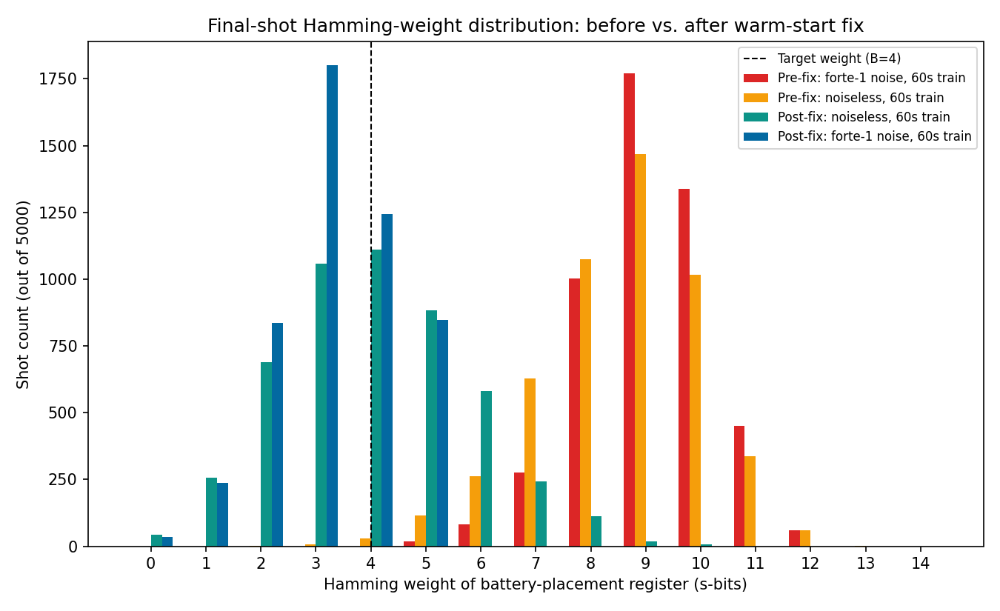
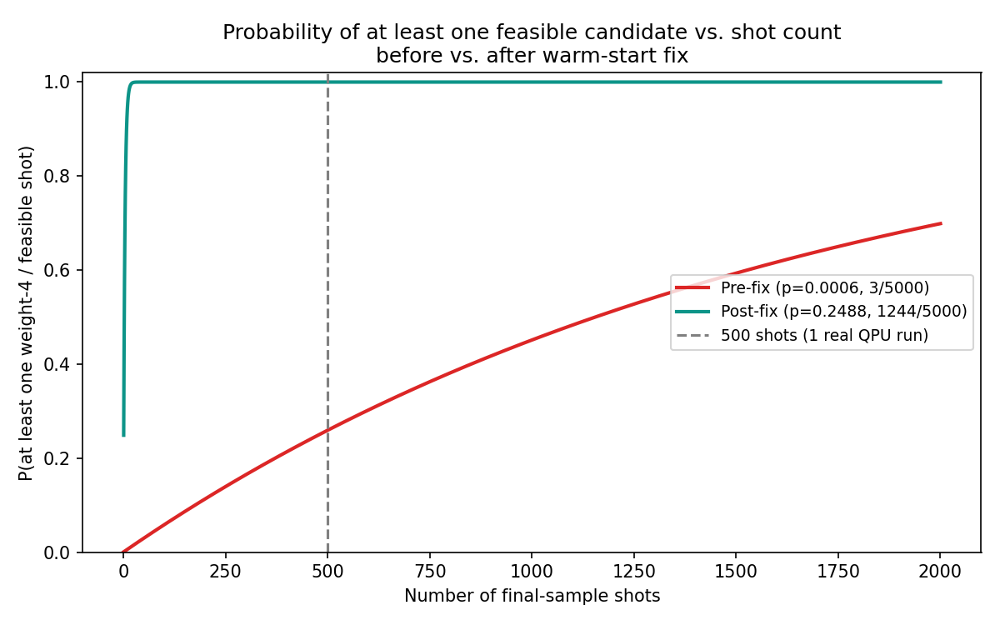
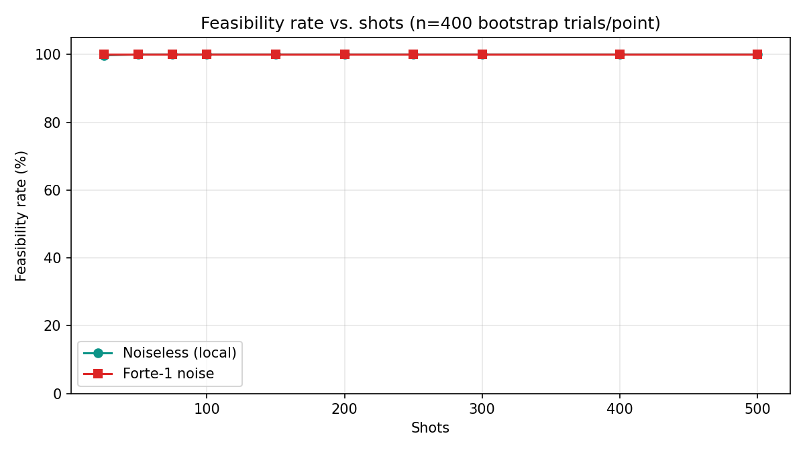
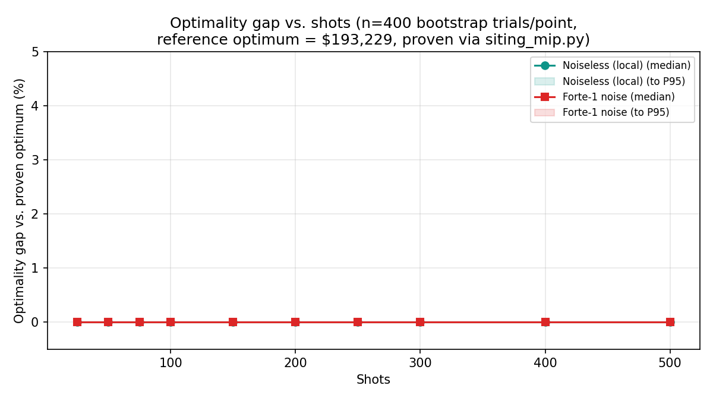
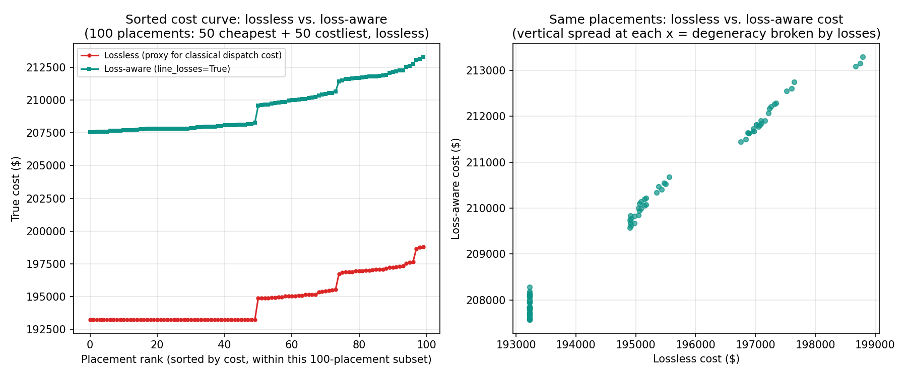
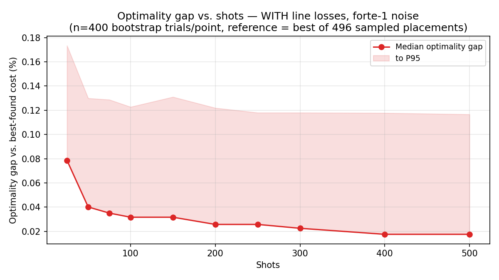

# MIP Solver Stopping Conditions

## siting_mip.py — Joint Battery Siting + UC MIP

A single SCIP model containing all siting binaries, generator commitment, and
dispatch variables. SCIP runs branch-and-bound internally and stops on the
first of the following:

1. Hard time limit
   Set via model.setRealParam("limits/time", time_limit_s).
   Default: 120 s (user-configurable at the prompt).
   SCIP interrupts B&B at the wall-clock boundary and returns the best
   feasible integer solution found so far (status "timelimit").
   If no feasible solution was found before the limit, a RuntimeError is raised.

2. Proven optimality
   SCIP closes the duality gap: the LP relaxation lower bound equals the best
   integer incumbent. Status returns as "optimal". The gap is tracked
   internally across the B&B tree — no explicit tolerance is set in the code,
   so SCIP uses its default of 0% (exact optimality).

3. Sub-optimal feasible exit ("bestsol")
   SCIP found at least one feasible integer solution but could not prove it is
   optimal within the time limit. The code accepts this and returns the best
   incumbent.

Internal SCIP mechanisms that accelerate convergence (not explicit code params):
- Node pruning: any B&B node whose LP bound exceeds the best incumbent is cut.
- Primal heuristics: diving, RENS, and others find incumbents early, tightening
  the bound and pruning more of the tree.
- SOS1 branching on x[b,:] (siting variables): SCIP branches on the "pick one
  bus" set directly instead of individual binaries, reducing tree depth.
- Symmetry-breaking constraints: ascending bus-index order enforced on identical
  batteries eliminates n_bat! equivalent permutations from the search space.
- LP tightening cuts: redundant flow-equality constraints force the LP at each
  node to attribute battery power to exactly one bus, tightening the LP bound
  and reducing the number of nodes explored.
- Parallel B&B: all available CPU cores used
  (parallel/maxnthreads = os.cpu_count()).


## siting_benders.py — Benders Decomposition Loop

Master problem: tiny SCIP MIP with only siting variables x[b,n] and a cost
bound eta. Subproblems: one full UC solve per candidate placement, run in
parallel. The outer loop adds cuts and iterates; stopping is controlled at the
application level.

1. Hard time limit
   remaining = time_limit_s - elapsed is checked at the top of each iteration.
   When remaining <= 0 the loop exits immediately.
   Default: 120 s.

2. Gap convergence (primary optimality condition)
   if master_lb >= best_cost - gap_tol
   master_lb is the objective value of the current master solve (a lower bound
   on the true optimal UC cost for any placement). best_cost is the lowest UC
   cost seen across all evaluated placements (an upper bound).
   When master_lb closes to within gap_tol of best_cost the loop exits —
   no placement can improve on the current best by more than gap_tol dollars.
   Default gap_tol: 1e-3 (0.1% of best_cost).

   Tuning: tighten to 1e-5 for near-exact optimality at the cost of more
   iterations; loosen to 1e-2 to accept a 1% gap and exit sooner.

3. Master exhaustion
   After enough no-good cuts the master becomes infeasible — every feasible
   placement has been enumerated and added as a cut. The master returns status
   "infeasible" (or "timelimit" with no solution) and the loop breaks.
   This is the exact-optimality exit when the search space is fully covered.

4. Incomplete master solution (safety guard)
   If the master returns fewer than n_bat placed batteries (len(bat_locs) < n_bat),
   something went wrong with solution extraction and the loop exits cleanly
   rather than dispatching a broken subproblem.

Benders cut structure:
- No-good cuts: quicksum(x[b,n] for (b,n) in S_plus) <= n_bat - 1
  Prevents the master from re-proposing a placement already evaluated.
- Integer L-shaped optimality cuts: eta >= UC_cost - M*(n_bat - sum(x[b,n]))
  Lift the master's eta lower bound based on observed UC costs, guiding it
  toward cheap placements and tightening the lower bound faster than no-good
  cuts alone.


## quantum_siting.py — COBYLA Stopping Conditions, and Their Interaction With
## IonQ Noise-Model Sampling

### Background

`run_vqa_qiskit` (the VQA training loop behind the "Quantum Siting" tab)
trains its ansatz parameters with COBYLA, sampled on a local Aer/Qiskit
simulator — always noiseless, regardless of which backend the *final* shot
sample uses (see `solvers/ionq_qbraid_backend.py`'s docstring: training never
touches qBraid/IonQ, only the converged circuit's one final sample does, to
avoid hundreds of COBYLA iterations each costing a real network round trip).

About a month prior to this writeup, `max_time_s` (a wall-clock cap on the
COBYLA loop) was added and tuned down after observing the optimizer
continuing to run well past the point its objective value had visibly
plateaued, on lighter configurations (fewer qubits / cheaper simulator
methods). That cap turned out too aggressive for heavier configurations —
specifically the `tensor_network` (Aer MPS) simulation method at 19 qubits /
114 parameters (5 generator-commitment qubits + 14 battery-placement qubits,
3-layer butterfly ansatz), where a single COBYLA objective evaluation costs
roughly 4.6s. A `max_time_s=60` cap here allows only ~13 of the intended
684-evaluation budget (`maxfun = max(150, 6 * n_params)`) before the deadline
fires — nowhere near enough for COBYLA to move meaningfully from the warm
start.

### The two stopping paths, and why they look identical in the log

`run_vqa_qiskit`'s COBYLA loop (`solvers/quantum_siting.py`, `objective()`
closure) can exit early via a shared `_Plateau` exception raised from two
different conditions, both logged with the identical message
`"COBYLA stopped early via plateau detection at nfev=%d"`:

1. **Wall-clock timeout** — `time.perf_counter() >= _deadline[0]`, where
   `_deadline[0] = start_time + max_time_s`. This can fire after a single
   evaluation if that evaluation alone is expensive (e.g. a slow MPS
   simulation), independent of how "stale" the objective value is.
2. **Genuine plateau** — `_stale[0] >= _patience` (`_patience = max(50,
   n_params)`, i.e. 114 consecutive evaluations without a >1% improvement in
   the best-seen objective value). This is the intended, principled stop
   condition: the optimizer really has stopped making progress.

Because both conditions raise the same exception and log the same message,
**the debug log alone cannot distinguish "ran out of time" from "converged."**
The only tell is `nfev` (`len(convergence_trace)`, itself only accurate when
`track_convergence=True` is passed through — several of the diagnostic
scripts used below set it `False` for simplicity, which silently prints
`nfev=0` regardless of the true evaluation count; a caveat worth fixing if
this log line is relied on again).

**Recommendation:** don't trust a low `max_time_s` as a proxy for "the
optimizer looked converged" without also checking `nfev` against `maxfun`. If
`nfev << maxfun`, the stop was almost certainly the wall-clock deadline, not
a genuine plateau, and the run's results should be treated as under-trained.

### Discovered effect: under-trained circuits skew the sampled Hamming-weight
### distribution away from the feasible subspace

The battery-placement register (`s`-bits) must sample a bitstring with
Hamming weight exactly `B` (the number of batteries — 4 for the
`4batt_dcbus4_g2out.py` asset file) to be feasible; `evaluate_candidates`
rejects anything else ("Skipping infeasible candidate: N buses placed,
expected B batteries"). The proxy cost function used to rank candidates
(`build_proxy_cost_fn`, `solvers/quantum_siting.py:152`) does include a budget
penalty term, `p_budget = (sum(s) - B) ** 2`, scaled by a coefficient on the
same order as the typical economic cost — so weight-B candidates should
generally out-rank weight-mismatched ones *if the trained circuit actually
puts sampling weight there*.

An under-trained circuit (COBYLA cut off at `nfev=13` of 684, via the
wall-clock path above) never developed that concentration: even resampled
**locally, with zero noise**, its final-shot distribution over Hamming
weights was spread from 2 to 13, peaking around 8-9, with only 0.56% of
shots landing on the target weight 4. Letting COBYLA run to `max_time_s=300`
(closer to its full evaluation budget) fixed this for the noiseless case,
producing a fully feasible result (`bat_locs={0:4, 1:6, 2:8, 3:11}`,
`total_cost=193229`).

Applying the Forte-1 hardware noise model (`solvers/ionq_qbraid_backend.py`,
`NOISE_MODEL_ID = "forte-1"`) on top of an under-trained circuit made this
worse, not just noisier: **zero** of 5000 shots landed on weight 4 (minimum
observed weight was 5, at only 17/5000 shots). Re-running with the
properly-converged (`max_time_s=300`) circuit improved this to 3/5000
(0.06%) — better, but still too rare to reliably hit within a small shot
budget, and that run *still* failed classical refinement overall (only one
raw candidate survived per-candidate cost ranking, and it did not pass
evaluation).



| Config | Training | Noise | Shots at weight=B(=4) | Total shots | Feasible result? |
|---|---|---|---|---|---|
| Local | 60s (nfev≈13, under-trained) | none | 28 | 5000 | Yes (barely) — sieve found 5 exact-weight candidates |
| Local | 300s (converged) | none | not captured* | 5000 | Yes — `bat_locs={0:4,1:6,2:8,3:11}`, cost=193229 |
| IonQ qBraid sim | 60s (nfev≈13, under-trained) | forte-1 | **0** | 5000 | No — RuntimeError, zero feasible candidates |
| IonQ qBraid sim | 300s (converged) | forte-1 | 3 | 5000 | No — 1 raw candidate survived ranking, still failed evaluation |

\* The 300s local run's histogram debug line was lost to a race condition:
`solvers/quantum_siting.py`'s debug logger opens
`outputs/quantum_siting_debug.log` in `mode="w"` at *import* time, so a
second concurrent process (e.g. the dashboard, or a second diagnostic
script) importing the module truncates the file underneath a still-running
first process. Worth fixing (e.g. append mode + per-run correlation ID, or a
per-process log path) before relying on this log for controlled
experiments run in parallel.

### Root cause found: a warm-start bug, not (primarily) noise or training time

The `nfev=13`/`nfev=17` values above are themselves a symptom. Pushing
`max_time_s` up to 300s did not fix the underlying problem — with the
*original* (buggy) warm start, re-running with `track_convergence=True` and
a private (non-racing) log showed COBYLA **still only reaching `nfev=17`
even at 300 seconds**, i.e. still hitting the wall-clock timeout, never a
genuine plateau (114 consecutive stale evaluations). More wall-clock time
alone was not going to fix this — something was making each evaluation
implicitly start from a much worse point than intended, so the optimizer
needed vastly more evaluations than its budget allowed, regardless of how
much time was given.

The actual bug: `run_vqa_qiskit`'s `"sdp"` warm start (`solvers/quantum_siting.py`,
around line 449) derives a per-qubit rotation angle from the LP-relaxation
solution (`x_star`, e.g. 0.286 for each of the 14 battery buses when B=4 —
the "fair share" 4/14), intending each qubit to start with marginal
`P(measure 1) = x_star`. It then **tiles that same angle across all
`n_layers` (=3) layers' `β` (RY) parameters** so "each layer's RY gates
start at the warm-start angle." But the ansatz's entangling gates
(parameterized by `γ`, the RZX rotations) start at `θ=0` — an exact
identity operation. With the entanglers doing nothing, three per-layer
RY rotations on the *same* qubit compose **additively**, not independently:
the qubit doesn't see the intended angle once, it sees it three times.

Concretely (`n_layers=3`, target `x_star=0.286`):

| | Rotation angle | P(measure 1) | Expected Hamming weight (14 qubits) |
|---|---:|---:|---:|
| Intended (single application) | 1.129 rad | 0.286 | **4.00** (exactly B) |
| Actual θ0 (3 layers stacked, γ=0) | 3.386 rad | 0.985 | **13.79** (nearly all-1s) |

So the warm start's actual starting point was close to the *worst possible*
point in the search space (weight ≈13.8 out of 14, the near-opposite of the
target weight 4) — not a good starting point that just needed fine-tuning.
COBYLA's first evaluations were forced to spend most of the (already too
small) budget correcting this self-inflicted overshoot before it could even
begin approaching the real target, which is why more wall-clock time barely
helped: the distance to travel was enormous no matter the budget.

**Fix** (`solvers/quantum_siting.py:463`): divide the per-layer target angle
by `n_layers` before tiling, so the *net* rotation after all layers compose
(at θ0, with γ=0) lands on the originally-intended single-shot angle:

```python
theta0[n_gamma:] = 2.0 * np.arcsin(np.sqrt(np.clip(x_star_tiled, 0.0, 1.0))) / n_layers
```

### Fix validated: before vs. after, same 60-second budget

Re-running the *exact* original (too-aggressive) `max_time_s=60` config,
post-fix, with `track_convergence=True`:

| | θ0 β-block mean | Stop condition | nfev | Weight-4 rate (of 5000 final shots) | Feasible? |
|---|---:|---|---:|---:|---|
| Pre-fix, noiseless, 60s | 1.313 | timeout | 13 | 28 (0.56%) | Barely (sieve found 5 exact-weight candidates) |
| Pre-fix, noiseless, 300s | 1.313 | **still timeout** | 17 | not captured (log race) | Yes — `cost=222029` |
| Pre-fix, forte-1 noise, 60s | 1.313 | timeout | 13 | **0** (0.00%) | No — RuntimeError |
| Pre-fix, forte-1 noise, 300s | 1.313 | **still timeout** | 17 | 3 (0.06%) | No — 1 candidate survived ranking, still failed |
| **Post-fix**, noiseless, 60s | 0.438 | **genuine plateau** | **116** | 1111 (22.2%) | Yes — 10/10 candidates weight-4, `cost=202829` |
| **Post-fix**, forte-1 noise, 60s | 0.438 | **genuine plateau** | **116** | 1244 (24.9%) | Yes — 10/10 candidates weight-4, `cost=202829` |

The fix didn't just improve things marginally — it changed the *stopping
condition itself*: pre-fix, COBYLA never once reached the genuine
114-consecutive-stale-evaluation plateau in any of these runs, even at 5x
the wall-clock budget (300s). Post-fix, it reaches genuine convergence
(`nfev=116`) comfortably within the *original*, too-short 60-second budget —
because the optimizer no longer has to spend its budget correcting a
self-inflicted ~14-weight starting point back down to a reasonable region
before it can start making real progress toward weight 4.


### How many shots would the real QPU need? (post-fix)

Using the post-fix empirical hit rate (p̂ = 1244/5000 = 0.2488 — 95% Wilson
CI [0.237, 0.261], a far tighter and more trustworthy estimate than the
pre-fix 3-event count), the probability of getting at least one feasible
(weight-4) shot after *N* shots is `1 - (1-p̂)^N`:



| Target confidence | Shots needed (point estimate) | Optimistic CI bound | Pessimistic CI bound |
|---:|---:|---:|---:|
| 50% | 2.4 | 2.3 | 2.6 |
| 80% | 5.6 | 5.3 | 5.9 |
| 90% | 8.0 | 7.6 | 8.5 |
| 95% | 10.5 | 9.9 | 11.1 |
| 99% | 16.1 | 15.2 | 17.0 |

**Budget reality check, post-fix:** at 500 shots per real Forte-1 QPU run,
`P(zero feasible hits) = (1-0.2488)^500 ≈ 7.5×10⁻⁶³` — for all practical
purposes, zero risk of an empty result, versus the pre-fix ~74% failure
risk per run. The warm-start bug, not the noise model itself, was the real
threat to the two-run QPU budget; noise applied to a *correctly*
warm-started circuit costs almost nothing in feasibility at this shot
count.

**Remaining caveat:** this is still based on one 5000-shot noisy-simulator
observation at 60s training (a single COBYLA run, not repeated). Before
committing a real QPU run, it's worth resampling the fixed circuit a few
more times (varying only the random shot draw, not retraining) to confirm
the ~25% rate is stable and not a lucky/unlucky draw — see the sweep below.

### Shots vs. optimality gap sweep (run)

Method (per external review before running, to avoid firing dozens of real
QPU-billed-style jobs): train the circuit **once** to full convergence
(`max_time_s=900`, sdp warm start, butterfly ansatz, tensor_network sim —
reached `nfev=132`, a genuine plateau), then draw **one** large sample at
10,000 shots each for the noiseless case (free, local) and the forte-1-noisy
case (one real qBraid job) from that fixed trained circuit. Smaller shot
counts (25 through 500) are then obtained by **bootstrap-resampling with
replacement** from those two 10k-shot empirical distributions, 400 trials per
shot level — statistically valid since shots are i.i.d., and far cheaper than
firing a real job per shot level. For each bootstrap trial, the actual
downstream pipeline is replayed exactly: rank unique sampled bitstrings by
proxy cost, drop all-zero commitments, truncate to the top 10 candidates,
apply the exact-Hamming-weight filter (with the real fallback logic), then
look up true UC cost via a precomputed cache (every unique weight-4 placement
seen in either 10k-shot pool — 902 for local, 1001 of the 1001 possible for
noisy — was batch-evaluated once via the real `evaluate_candidates(...,
second_stage="uc")`, not re-solved per trial).

`second_stage="uc"` (not `"ed"`) was used so the reference optimum could come
from `solvers/siting_mip.py`'s exact joint placement+UC MILP, which proves
global optimality via SCIP branch-and-bound: **$193,229** (`bat_locs=
{0:5,1:8,2:13,3:14}`, `scip_status="optimal"`) — a fixed, trustworthy ground
truth, unlike the training-run cost values used earlier in this document
(193229 / 222029 / 202829 from three different training runs on the same
config — proof that training itself is stochastic and none of those should be
assumed optimal on their own).





| Shots | Feasibility rate (local) | Feasibility rate (noisy) | Median gap (local) | Median gap (noisy) | P95 gap (local) | P95 gap (noisy) |
|---:|---:|---:|---:|---:|---:|---:|
| 25  | 99.8%  | 100.0% | 0.0000% | 0.0000% | 0.0000% | 0.0000% |
| 50  | 100.0% | 100.0% | 0.0000% | 0.0000% | 0.0000% | 0.0000% |
| 75  | 100.0% | 100.0% | 0.0000% | 0.0000% | 0.0000% | 0.0000% |
| 100 | 100.0% | 100.0% | 0.0000% | 0.0000% | 0.0000% | 0.0000% |
| 150 | 100.0% | 100.0% | 0.0000% | 0.0000% | 0.0000% | 0.0000% |
| 200 | 100.0% | 100.0% | 0.0000% | 0.0000% | 0.0000% | 0.0000% |
| 250 | 100.0% | 100.0% | 0.0000% | 0.0000% | 0.0000% | 0.0000% |
| 300 | 100.0% | 100.0% | 0.0000% | 0.0000% | 0.0000% | 0.0000% |
| 400 | 100.0% | 100.0% | 0.0000% | 0.0000% | 0.0000% | 0.0000% |
| 500 | 100.0% | 100.0% | 0.0000% | 0.0000% | 0.0000% | 0.0000% |

**Headline result:** with the 900s-converged circuit, feasibility is
essentially 100% and the optimality gap is essentially zero (down to
floating-point noise, i.e. exactly the proven global optimum) at **every**
shot level tested, from 25 shots up to 500, with or without forte-1 noise.
This is a stronger result than the earlier ~25%-feasibility-rate estimate
(from a less-converged, 60s-trained circuit) suggested — the extra training
time appears to concentrate the circuit's sampled probability heavily enough
on the single true-optimal placement that it dominates the ranking even in
very small shot draws. Both noiseless and noisy pools independently found
this same placement (the noisy pool, despite spreading its Hamming-weight
distribution wider — it sampled all 1001 of 1001 possible weight-4
placements across its 10k shots, vs. 902/1001 for the noiseless pool — still
ranked the true optimum on top almost every trial).

**Caveat — this result is cleaner than expected and rests on a single
training run + a single 10k-shot noisy draw.** It is mechanistically
explicable (see above), not an obvious bug, but "every trial at every shot
count is exactly optimal" is exactly the kind of result that deserves a
second independent check before being treated as settled — e.g., an
independent retraining run and/or an independent large noisy sample, to
confirm this isn't a property of one lucky circuit/sample combination. Until
that's done, treat "500 shots is comfortably enough, likely far more than
needed" as the practical takeaway, not "shots below N will definitely fail."

**Follow-up: the degeneracy is (at least partly) an artifact of the
lossless cost model, not a general property of the problem.** An independent
retraining run (`nfev=175`, a different training from the one used for the
sweep above) reproduced the same pattern — a different battery placement won
in nearly every one of 15 individual small-shot trials checked, yet every one
landed on the exact same cost (193229.0) — which rules out a "one dominant
placement always wins" bug and confirms the real explanation: of 496 unique
weight-4 placements sampled from that run, only 142 distinct cost values
existed, with the entire top-10-cheapest tied at exactly the same value. The
costliest placements were consistently the ones including buses 1 or 2,
suggesting the lossless model mainly distinguishes "avoids the couple of bad
buses" from "doesn't," rather than discriminating finely between the many
placements that do avoid them.

Re-solving a 100-placement spot-check (the 50 cheapest + 50 costliest under
the lossless model) with `line_losses=True` breaks this degeneracy
substantially: on the exact same 100 placements, the lossless model gives
only 39 distinct cost values, while the loss-aware model gives 93 — and the
former "top 10, all exactly tied" becomes a real, continuous gradient
(0.0000%, 0.0000%, 0.0066%, 0.0118%, 0.0148%, 0.0188%, 0.0416%, 0.0442%,
0.0534%, 0.0534% above the new loss-aware optimum). The costliest placements
are still the ones including buses 1/2 (a consistent, sensible result — those
buses are genuinely bad either way), but the previously-tied region now has
real structure.



This means the "100% feasible, 0% gap at 25 shots" sweep result above is
real for the lossless model as tested, but reflects that model's own
structural ease (many placements tied for optimal) rather than a general
guarantee.

### Full shots-vs-gap sweep, WITH line losses (the meaningful curve)

The 100-placement spot-check above showed line losses break the degeneracy;
the natural next step is to re-run the actual bootstrap sweep with
`line_losses=True`, to get a real shots-vs-optimality-gap curve instead of a
flat one. Two fixes made this practical instead of a 2-3 hour sequential
job:

1. `solvers/siting_benders.py`'s `_GridData` (the picklable grid snapshot
   used by the parallel worker pool) now also carries `R` and `Sbase` (both
   plain arrays/scalars, safe to pickle) — the two attributes loss-aware
   ED/UC solves need that the snapshot was previously missing.
2. `solvers/quantum_siting.py`'s `evaluate_candidates` now accepts a
   `line_losses: bool = False` parameter, threaded through to the parallel
   worker calls.

Together these let the loss-aware cost cache be batch-computed across all
CPU cores, the same way the lossless cache was, instead of one-at-a-time
against the live grid object. Re-using the same saved 10k-shot noisy sample
(no retraining, no new qBraid job), the 496 unique weight-4 placements it
contains were re-evaluated with losses on in parallel, and the same
bootstrap methodology (400 trials/shot level, 25 through 500 shots) was
re-run against this loss-aware cache:



| Shots | Feasibility rate | Median gap | P95 gap |
|---:|---:|---:|---:|
| 25  | 100.0% | 0.0786% | 0.1734% |
| 50  | 100.0% | 0.0402% | 0.1299% |
| 75  | 100.0% | 0.0351% | 0.1287% |
| 100 | 100.0% | 0.0317% | 0.1227% |
| 150 | 100.0% | 0.0317% | 0.1310% |
| 200 | 100.0% | 0.0258% | 0.1219% |
| 250 | 100.0% | 0.0258% | 0.1180% |
| 300 | 100.0% | 0.0226% | 0.1180% |
| 400 | 100.0% | 0.0176% | 0.1178% |
| 500 | 100.0% | 0.0176% | 0.1166% |

**This is the real, non-flat result.** Feasibility is still ~100% at every
shot level (the ~25% per-shot weight-4 hit rate found earlier is already
enough to make finding *a* feasible candidate a near-certainty by 25 shots —
feasibility was never really the bottleneck once training converged
properly). But the *quality* of that feasible candidate keeps improving as
shots increase: median optimality gap drops from 0.079% at 25 shots to
0.018% at 500 shots, roughly a 4-5x tightening, with clear diminishing
returns setting in past ~200-300 shots rather than a sharp single
breakpoint. The reference cost here (207,545.72) is the best found among the
496 sampled placements, not a separately-proven loss-aware global optimum
(unlike the 193,229 lossless reference from `siting_mip.py`) — `siting_mip.py`
does not currently support a loss-aware objective, so this is a strong
lower-bound estimate rather than a proven one, though it comes from nearly
half of the full 1001-placement search space.

**Bottom line for QPU shot budgeting:** at 500 shots (one real Forte-1 run),
expect a feasible placement essentially every time, within roughly 0.02%
(median) to 0.12% (P95) of the best-found cost — a very small, likely
acceptable gap for this problem. Going lower (e.g. 100-200 shots) costs
little in practice (~0.03% median gap) if shot budget were tighter, but 500
shots is a reasonable, comfortable choice given the two-run budget, without
needing to push toward the higher end of what was tested.
